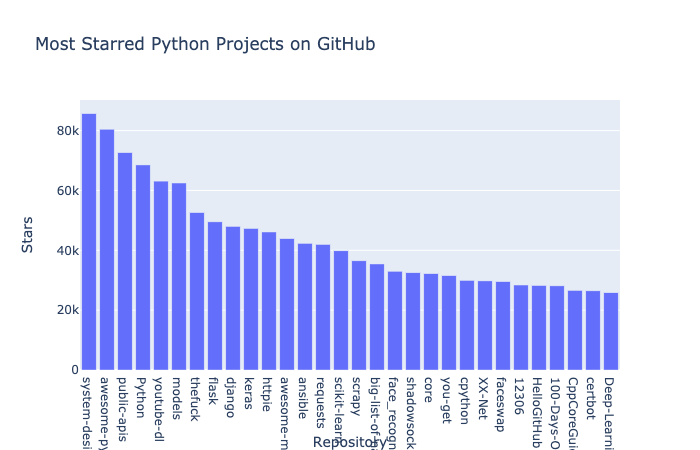
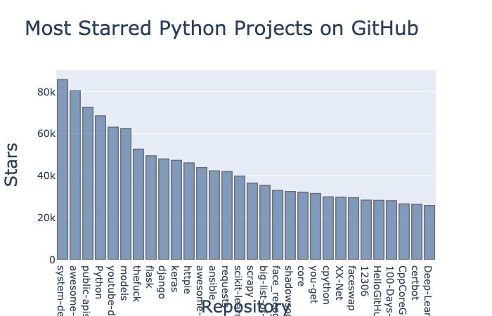
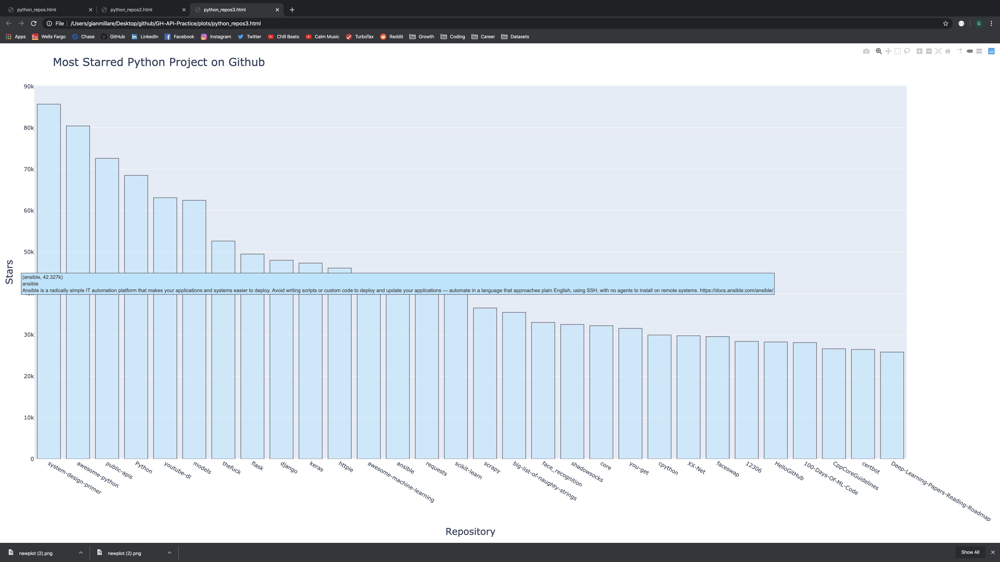
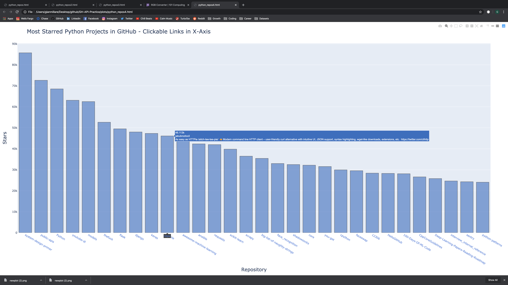

# GH-API-Practice

This purposeful practice project is from Eric Matthes project-based programming book titled "Python Crash Course".

The sole purpose of this project was to practice and hone my Python-API skills using GitHub API. Application Programming Interfaces (or APIs) are a popular and reliable data source because data will be up-to-date and can exhibit synergy with programming languages (i.e. Python). This repository showcases the various methods that programmers can use for data-based projects regarding APIs. 

This repositry also serves as a reference as I plan on using APIs in future personal and professional projects.

---------------------------------------------------------------------------------------------------------------------------

### Below is a screenshot/sneak peak at the code used throughout the repository

------------------------------------------------------------------------------------------------------------------------------

### Preview 1: Visuzalizing the standard (top 30) Most Starred Python Projects pulled from GitHub API

------------------------------------------------------------------------------------------------------------------------------

### Preview 2: Customizing some of the plots features
Here I changed the color and also altered the titles of the plot.

------------------------------------------------------------------------------------------------------------------------------

### Preview 3: Completion of the repository. 
I alter the data to make the graph more clear, and also apply a "hover" affect that will show the name and description of the bar (first image). Then I add in another feature that allows the user to click on an x-axis title, which will bring them to the projects GitHub Repository (second image).

------------------------------------------------------------------------------------------------------------------------------

------------------------------------------------------------------------------------------------------------------------------
